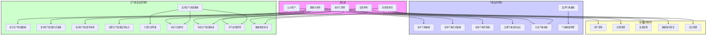

```mermaid
graph TD
    %% 使用更清晰的布局
    subgraph 参与者
        direction LR
        A[系统管理员]
        B[维护工程师]
        C[数据分析师]
        D[公众用户]
        E[监管机构]
    end
    
    subgraph 气象监测用例
        F1[监测气象数据]
        F2[显示气象数据]
        F3[查询气象历史数据]
        F4[校准气象传感器]
        F5[设置气象监测站点]
        F6[生成气象报表]
        F7[气象数据预警]
    end
    
    subgraph 空气质量监测用例
        G1[监测空气质量数据]
        G2[显示空气质量数据]
        G3[查询空气质量历史极值]
        G4[校准空气质量传感器]
        G5[设置空气质量监测站点]
        G6[计算污染等级]
        G7[分析污染趋势]
        G8[生成空气质量报表]
        G9[空气质量预警]
        G10[数据质量验证]
    end
    
    subgraph 系统管理用例
        H1[用户管理]
        H2[权限管理]
        H3[系统配置]
        H4[数据备份恢复]
        H5[日志管理]
    end
    
    %% 连接线
    A --> F5
    A --> G5
    A --> H1
    A --> H2
    A --> H3
    A --> H4
    A --> H5
    
    B --> F4
    B --> G4
    B --> G10
    
    C --> F3
    C --> F6
    C --> G3
    C --> G7
    C --> G8
    
    D --> F2
    D --> G2
    D --> G9
    
    E --> F6
    E --> G8
    E --> G10
    
    %% 内部依赖
    G1 --> G6
    G1 --> G7
    F1 --> F7
    G1 --> G9
    
    %% 样式美化（可选）
    linkStyle default stroke:#333,stroke-width:2px
    style 参与者 fill:#f9f,stroke:#333,stroke-width:2px
    style 气象监测用例 fill:#ccf,stroke:#333,stroke-width:2px
    style 空气质量监测用例 fill:#cfc,stroke:#333,stroke-width:2px
    style 系统管理用例 fill:#ffc,stroke:#333,stroke-width:2px
```
